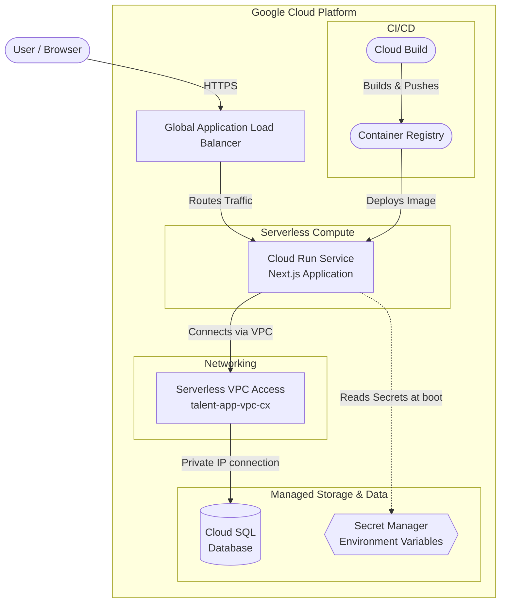

# Idea App

Idea App is a full-stack Next.js web application deployed on Google Cloud Platform. This repository contains the application source code, Docker build instructions, and Cloud Build CI/CD configurations.

## Architecture

The application is built to be highly scalable, secure, and fully managed using Google Cloud's serverless and managed services.



### Components

*   **Global Application Load Balancer**: Fronts the application, providing global anycast IP routing, SSL termination, and CDN caching capabilities. It routes incoming traffic to the appropriate Cloud Run service.
*   **Cloud Run**: The fully managed serverless compute environment hosting the containerized Next.js application. 
    *   **Startup Lifecycle**: When a new instance spins up, it executes `start.sh`, which first runs `npx prisma db push --skip-generate` to provision the database schema, and then launches the Next.js production server.
*   **Cloud SQL**: The managed relational database solution storing the application's core data. Accessed securely from Cloud Run via a Serverless VPC connector.
*   **Secret Manager**: securely stores sensitive environment variables, injecting them into the Cloud Run container at startup. Secrets include:
    *   `DATABASE_URL`
    *   `GOOGLE_CLIENT_ID`
    *   `GOOGLE_CLIENT_SECRET`
*   **Cloud Build**: The continuous integration and delivery pipeline defined in `cloudbuild.yaml`. It continuously monitors branches, builds Docker images, pushes them to the Container Registry, and deploys the new revisions directly to Cloud Run.

## Development Stack

*   **Frontend**: Next.js, React
*   **Backend**: Next.js App Router (Node.js runtime)
*   **Database ORM**: Prisma
*   **Containerization**: Docker

## Getting Started Locally

First, install dependencies:

```bash
npm install
```

Ensure your environment variables (like `DATABASE_URL` and Auth credentials) are configured in a `.env` file, then run the development server:

```bash
npm run dev
```

Open [http://localhost:3000](http://localhost:3000) with your browser to see the result.
